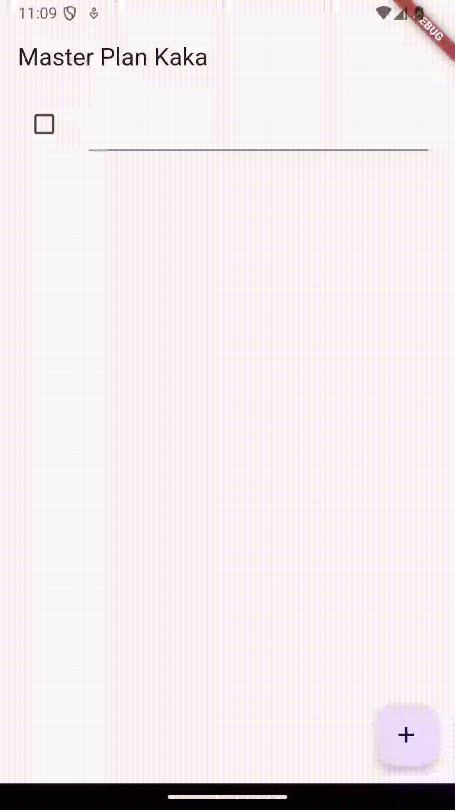

# 10 | Dasar State Management

**NAMA : MOCHAMMAD ZAKARO AL FAJRI**

**KELAS : TI-3F**

**NO ABSEN : 14**

**NIM : 2241720175**

## Praktikum 1: Dasar State dengan Model-View

### Langkah 1: Buat Project Baru

**Buatlah sebuah project flutter baru dengan nama master_plan**

### Langkah 2: Membuat model task.dart 

### Langkah 3: Buat file plan.dart

**Buat file plan.dart di dalam folder models**

### Langkah 4: Buat file data_layer.dart

**Buat file bernama data_layer.dart di folder models.**

### Langkah 5: Pindah ke file main.dart 

**Ubah isi kode main.dart sebagai berikut.**

### Langkah 6: buat plan_screen.dart

**buatlah sebuah file `plan_screen.dart` dan gunakan templat `StatefulWidget`**

### Langkah 7: buat method _buildAddTaskButton()

**Tambah kode berikut di bawah method build di dalam class `_PlanScreenState`**

### Langkah 8: buat widget _buildList()

**Kita akan buat widget berupa List yang dapat dilakukan scroll, yaitu ListView.builder. Buat widget ListView seperti kode berikut ini.**

### Langkah 9: buat widget _buildTaskTile

**Tambahkan kode berikut ini.**

**Hasil Run :**

### Langkah 10: Tambah Scroll Controller

**Pada file `plan_screen.dart`, tambahkan variabel scroll controller di class State tepat setelah variabel plan.**

### Langkah 11: Tambah Scroll Listener

**Tambahkan method initState() setelah deklarasi variabel scrollController seperti kode berikut.**

### Langkah 12: Tambah controller dan keyboard behavior

**Tambahkan controller dan keyboard behavior pada ListView di method `_buildList` seperti kode berikut ini.**

### Langkah 13: Terakhir, tambah method dispose()

**Terakhir, tambahkan method dispose() berguna ketika widget sudah tidak digunakan lagi.**

### Langkah 14: Hasil

**Lakukan Hot restart (bukan hot reload) pada aplikasi Flutter Anda. Anda akan melihat tampilan akhir seperti gambar berikut. Jika masih terdapat error, silakan diperbaiki hingga bisa running.**

## Tugas Praktikum 1: Dasar State dengan Model-View

**1. Selesaikan langkah-langkah praktikum tersebut, lalu dokumentasikan berupa GIF hasil akhir praktikum beserta penjelasannya di file README.md! Jika Anda menemukan ada yang error atau tidak berjalan dengan baik, silakan diperbaiki.**

Jawab :  Sudah, dan semua berjalan dengan baik

**2. Jelaskan maksud dari langkah 4 pada praktikum tersebut! Mengapa dilakukan demikian?** 

Jawab : Langkah keempat dalam praktikum tersebut bertujuan untuk mengemas beberapa data layer ke dalam satu file yang nantinya akan digunakan untuk mengekspor kedua model tersebut.

**3. Mengapa perlu variabel plan di langkah 6 pada praktikum tersebut? Mengapa dibuat konstanta ?**

Jawab : Pada langkah 6, variabel plan digunakan untuk menyimpan data yang akan dipakai dalam aplikasi. Variabel plan didefinisikan sebagai konstanta agar data yang tersimpan tidak bisa diubah.

**3. Lakukan capture hasil dari Langkah 9 berupa GIF, kemudian jelaskan apa yang telah Anda buat!**

Jawab : Saya membuat membuat widget _buildTaskTile untuk membuat dan menambahkan list task

**5. Apa kegunaan method pada Langkah 11 dan 13 dalam lifecyle state ?** 

Jawab : Method pada langkah 11 digunakan untuk menambahkan listener pada scroll controller, sementara method pada langkah 13 digunakan untuk membersihkan scroll controller.

## Praktikum 2: Mengelola Data Layer dengan InheritedWidget dan InheritedNotifier

### Langkah 1: Buat file plan_provider.dart

**Buat folder baru provider di dalam folder `lib`**

