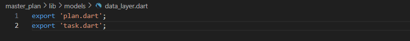
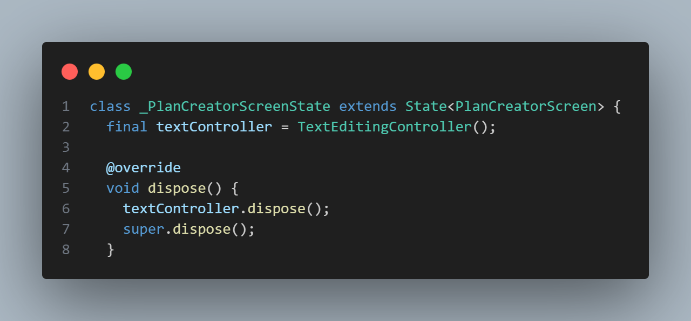

# 10 | Dasar State Management

**NAMA : MOCHAMMAD ZAKARO AL FAJRI**

**KELAS : TI-3F**

**NO ABSEN : 14**

**NIM : 2241720175**

## Praktikum 1: Dasar State dengan Model-View

### Langkah 1: Buat Project Baru

**Buatlah sebuah project flutter baru dengan nama master_plan**

### Langkah 2: Membuat model task.dart 

### Langkah 3: Buat file plan.dart

**Buat file plan.dart di dalam folder models**

### Langkah 4: Buat file data_layer.dart

**Buat file bernama data_layer.dart di folder models.**

### Langkah 5: Pindah ke file main.dart 

**Ubah isi kode main.dart sebagai berikut.**

### Langkah 6: buat plan_screen.dart

**buatlah sebuah file `plan_screen.dart` dan gunakan templat `StatefulWidget`**

### Langkah 7: buat method _buildAddTaskButton()

**Tambah kode berikut di bawah method build di dalam class `_PlanScreenState`**

### Langkah 8: buat widget _buildList()

**Kita akan buat widget berupa List yang dapat dilakukan scroll, yaitu ListView.builder. Buat widget ListView seperti kode berikut ini.**

### Langkah 9: buat widget _buildTaskTile

**Tambahkan kode berikut ini.**

**Hasil Run :**

### Langkah 10: Tambah Scroll Controller

**Pada file `plan_screen.dart`, tambahkan variabel scroll controller di class State tepat setelah variabel plan.**

### Langkah 11: Tambah Scroll Listener

**Tambahkan method initState() setelah deklarasi variabel scrollController seperti kode berikut.**

### Langkah 12: Tambah controller dan keyboard behavior

**Tambahkan controller dan keyboard behavior pada ListView di method `_buildList` seperti kode berikut ini.**

### Langkah 13: Terakhir, tambah method dispose()

**Terakhir, tambahkan method dispose() berguna ketika widget sudah tidak digunakan lagi.**

### Langkah 14: Hasil

**Lakukan Hot restart (bukan hot reload) pada aplikasi Flutter Anda. Anda akan melihat tampilan akhir seperti gambar berikut. Jika masih terdapat error, silakan diperbaiki hingga bisa running.**

## Tugas Praktikum 1: Dasar State dengan Model-View

**1. Selesaikan langkah-langkah praktikum tersebut, lalu dokumentasikan berupa GIF hasil akhir praktikum beserta penjelasannya di file README.md! Jika Anda menemukan ada yang error atau tidak berjalan dengan baik, silakan diperbaiki.**

Jawab :  Sudah, dan semua berjalan dengan baik

**2. Jelaskan maksud dari langkah 4 pada praktikum tersebut! Mengapa dilakukan demikian?** 

Jawab : Langkah keempat dalam praktikum tersebut bertujuan untuk mengemas beberapa data layer ke dalam satu file yang nantinya akan digunakan untuk mengekspor kedua model tersebut.

**3. Mengapa perlu variabel plan di langkah 6 pada praktikum tersebut? Mengapa dibuat konstanta ?**

Jawab : Pada langkah 6, variabel plan digunakan untuk menyimpan data yang akan dipakai dalam aplikasi. Variabel plan didefinisikan sebagai konstanta agar data yang tersimpan tidak bisa diubah.

**3. Lakukan capture hasil dari Langkah 9 berupa GIF, kemudian jelaskan apa yang telah Anda buat!**

Jawab : Saya membuat membuat widget _buildTaskTile untuk membuat dan menambahkan list task

**5. Apa kegunaan method pada Langkah 11 dan 13 dalam lifecyle state ?** 

Jawab : Method pada langkah 11 digunakan untuk menambahkan listener pada scroll controller, sementara method pada langkah 13 digunakan untuk membersihkan scroll controller.

## Praktikum 2: Mengelola Data Layer dengan InheritedWidget dan InheritedNotifier

### Langkah 1: Buat file plan_provider.dart

**Buat folder baru provider di dalam folder `lib`**

### Langkah 2: Edit main.dart

**Gantilah pada bagian atribut home dengan PlanProvider**

### Langkah 3: Tambah method pada model plan.dart

**Tambahkan dua method di dalam model class Plan**

### Langkah 4: Pindah ke PlanScreen

**Edit PlanScreen agar menggunakan data dari PlanProvider. Hapus deklarasi variabel plan (ini akan membuat error). Kita akan perbaiki pada langkah 5 berikut ini.**

### Langkah 5: Edit method _buildAddTaskButton

**Tambahkan BuildContext sebagai parameter dan gunakan PlanProvider sebagai sumber datanya**

### Langkah 6: Edit method _buildTaskTile

**Tambahkan parameter BuildContext, gunakan PlanProvider sebagai sumber data. Ganti TextField menjadi TextFormField**

### Langkah 7: Edit _buildList

**Sesuaikan parameter pada bagian _buildTaskTile**

### Langkah 8: Tetap di class PlanScreen

**Edit method build sehingga bisa tampil progress pada bagian bawah (footer)**

### Langkah 9: Tambah widget SafeArea

**Tambahkan widget SafeArea dengan berisi completenessMessage pada akhir widget Column**

**Hasil Run :**

## Tugas Praktikum 2: InheritedWidget

**1. Selesaikan langkah-langkah praktikum tersebut, lalu dokumentasikan berupa GIF hasil akhir praktikum beserta penjelasannya di file README.md! Jika Anda menemukan ada yang error atau tidak berjalan dengan baik, silakan diperbaiki sesuai dengan tujuan aplikasi tersebut dibuat.**

Jawab : Sudah dan semua berjalan dengan baik

**2. Jelaskan mana yang dimaksud InheritedWidget pada langkah 1 tersebut! Mengapa yang digunakan InheritedNotifier?**

Jawab : InheritedWidget pada langkah pertama berfungsi untuk mendistribusikan data ke dalam pohon widget. Sementara itu, InheritedNotifier digunakan karena merupakan turunan dari InheritedWidget yang memiliki kemampuan untuk memberi tahu widget yang menggunakan data tersebut agar melakukan rebuild saat data mengalami perubahan.

**3. Jelaskan maksud dari method di langkah 3 pada praktikum tersebut! Mengapa dilakukan demikian?**

Jawab : Pada langkah 3, metode digunakan untuk menghitung jumlah tugas yang telah diselesaikan dan menampilkan pesan yang sesuai berdasarkan jumlah tugas yang selesai.

**4. Lakukan capture hasil dari Langkah 9 berupa GIF, kemudian jelaskan apa yang telah Anda buat!**

Jawab : Pada langkah 9, Saya menambahkan widget SafeArea pada method build yang berguna untuk meanmbahkan padding sehingga tepi aplikasi memiliki jarak

## Praktikum 3: Membuat State di Multiple Screens

### Langkah 1: Edit PlanProvider

**Edit class PlanProvider sehingga dapat menangani List Plan.**

### Langkah 2: Edit main.dart

**Langkah sebelumnya dapat menyebabkan error pada main.dart dan plan_screen.dart. Pada method build, gantilah menjadi kode seperti ini.**

### Langkah 3: Edit plan_screen.dart

**Tambahkan variabel plan dan atribut pada constructor-nya**

### Langkah 4: Error

**Itu akan terjadi error setiap kali memanggil PlanProvider.of(context). Itu terjadi karena screen saat ini hanya menerima tugas-tugas untuk satu kelompok Plan, tapi sekarang PlanProvider menjadi list dari objek plan tersebut.**

### Langkah 5: Tambah getter Plan

**Tambahkan getter pada _PlanScreenState**

### Langkah 6: Method initState()

### Langkah 7: Widget build

**Pastikan Anda telah merubah ke List dan mengubah nilai pada currentPlan**

### Langkah 8: Edit _buildTaskTile

**ubah ke List dan variabel planNotifier**

### Langkah 9: Buat screen baru

**buatlah file baru dengan nama plan_creator_screen.dart dan deklarasikan dengan StatefulWidget bernama PlanCreatorScreen**

### Langkah 10: Pindah ke class _PlanCreatorScreenState

**tambahkan variabel TextEditingController sehingga bisa membuat TextField sederhana untuk menambah Plan baru**

### Langkah 11: Pindah ke method build

**Letakkan method Widget build berikut di atas void dispose**

### Langkah 12: Buat widget _buildListCreator

### Langkah 13: Buat void addPlan()

**Tambahkan method berikut untuk menerima inputan dari user berupa text plan**

### Langkah 14: Buat widget _buildMasterPlans()

**Hasil Run :**

### Tugas Praktikum 3: State di Multiple Screens

**1. Selesaikan langkah-langkah praktikum tersebut, lalu dokumentasikan berupa GIF hasil akhir praktikum beserta penjelasannya di file README.md! Jika Anda menemukan ada yang error atau tidak berjalan dengan baik, silakan diperbaiki sesuai dengan tujuan aplikasi tersebut dibuat.**

Jawab : Sudah dan semua pengerjaan baik.

**2. Jelaskan maksud dari gambar diagram berikut ini!**

Jawab : 

Gambar tersebut mendeskripsikan alur navigasi dalam sebuah aplikasi Flutter. Dimulai dari `MaterialApp` yang membungkus `PlanProvider`, yang kemudian menampilkan layar awal yaitu `PlanCreatorScreen`. Pada layar ini, struktur utamanya terdiri dari `Column` yang berisi `TextField` untuk input data dan `Expanded` yang mengakomodasi `ListView` sebagai daftar tugas.

Pengguna dapat beralih ke `PlanScreen` melalui **Navigator Push**. Layar ini menggunakan `Scaffold` dengan `Column` yang berisi `Expanded` untuk menampilkan daftar tugas dalam `ListView` dan `SafeArea` untuk menampilkan teks tambahan di area yang aman.

Alur ini menunjukkan perpindahan dari layar pembuatan rencana ke layar utama untuk mengelola dan melihat rencana yang telah dibuat.

**3.Lakukan capture hasil dari Langkah 9 berupa GIF, kemudian jelaskan apa yang telah Anda buat!**

Jawab : Pada langkah 9 dilakukan pembuatan _buildMasterPlans yang berguna untuk membuat list rencana yang sudah dibuat sebelumnya

