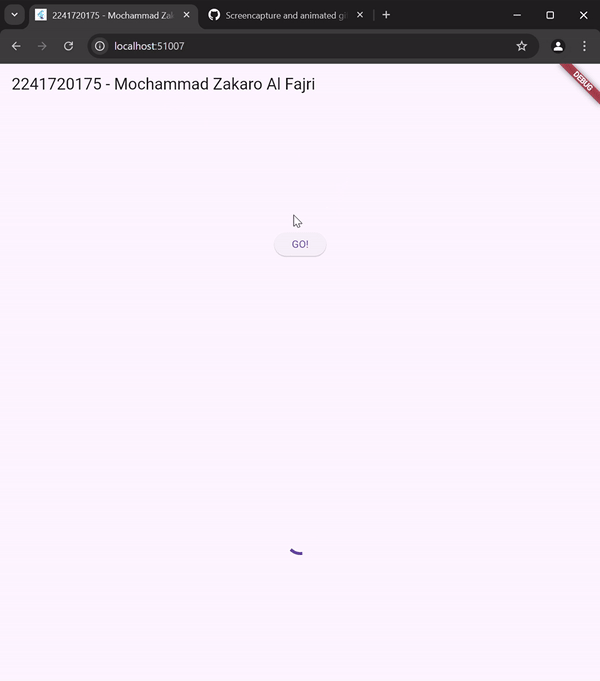
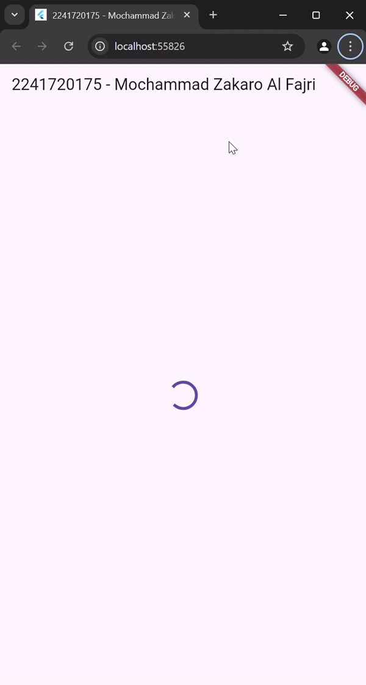
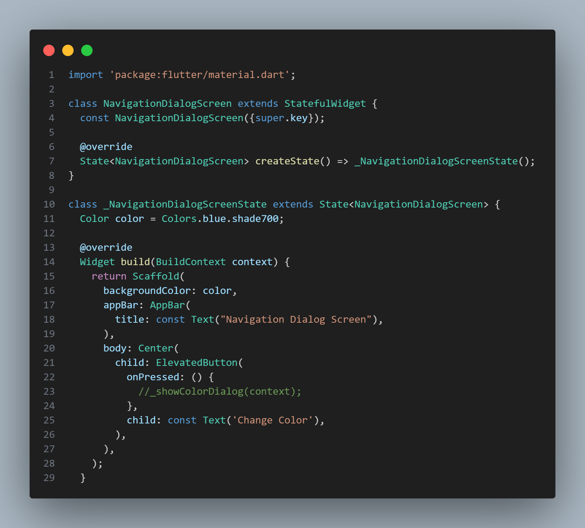

# Jobsheet 11 | Pemrograman Asynchronous

**NAMA : MOCHAMMAD ZAKARO AL FAJRI**

**KELAS : TI - 3F**

**ABSEN : 14**

**NIM : 2241720175**

---
## Praktikum 1: Mengunduh Data dari Web Service (API)

### Langkah 1: Buat Project Baru

**Buatlah sebuah project flutter baru dengan nama books di folder src week-11 repository GitHub Anda.**

### Langkah 2: Cek file pubspec.yaml
**Jika berhasil install plugin, pastikan plugin http telah ada di file pubspec ini seperti berikut.**

### Langkah 3: Buka file main.dart

### Soal 1 Tambahkan nama panggilan Anda pada title app sebagai identitas hasil pekerjaan Anda.

### Langkah 4: Tambah method getData()

**Tambahkan method ini ke dalam class _FuturePageState yang berguna untuk mengambil data dari API Google Books.**

### Soal 2 

- **Carilah judul buku favorit Anda di Google Books, lalu ganti ID buku pada variabel path di kode tersebut. Caranya ambil di URL browser Anda seperti gambar berikut ini.**

-  **Kemudian cobalah akses di browser URI tersebut dengan lengkap seperti ini. Jika menampilkan data JSON, maka Anda telah berhasil. Lakukan capture milik Anda dan tulis di README pada laporan praktikum. Lalu lakukan commit dengan pesan "W11: Soal 2".**

### Langkah 5: Tambah kode di ElevatedButton

**Tambahkan kode pada onPressed di ElevatedButton**

### Soal 3 :

**Jelaskan maksud kode langkah 5 tersebut terkait substring dan catchError!**

Jawab : Metode substring digunakan untuk mengambil bagian tertentu dari sebuah string berdasarkan indeks yang ditentukan. Sementara itu, catchError berfungsi untuk menangani kesalahan yang muncul dalam kode.

**Capture hasil praktikum Anda berupa GIF dan lampirkan di README. Lalu lakukan commit dengan pesan "W11: Soal 3".**

## Praktikum 2: Menggunakan await/async untuk menghindari callbacks

### Langkah 1: Buka file main.dart

**Tambahkan tiga method berisi kode seperti berikut di dalam class _FuturePageState.**

### Langkah 2: Tambah method count()

**Lalu tambahkan lagi method ini di bawah ketiga method sebelumnya.**

### Langkah 3: Panggil count()

**Lakukan comment kode sebelumnya, ubah isi kode onPressed()**

### Langkah 4: Run

**Akhirnya, run atau tekan F5 jika aplikasi belum running. Maka Anda akan melihat seperti gambar berikut, hasil angka 6 akan tampil setelah delay 9 detik.**

### Soal 4:

**Jelaskan maksud kode langkah 1 dan 2 tersebut!**

Jawab : Langkah 1 adalah fungsi asinkron yang masing-masing menunggu selama 3 detik sebelum mengembalikan nilai integer (1, 2, dan 3).

**Capture hasil praktikum Anda berupa GIF dan lampirkan di README. Lalu lakukan commit dengan pesan "W11: Soal 4".**

## Praktikum 3: Menggunakan Completer di Future

### Langkah 1: Buka main.dart

**Pastikan telah impor package async**

### Langkah 2: Tambahkan variabel dan method

**Tambahkan variabel late dan method di class _FuturePageState seperti ini.**

### Langkah 3: Ganti isi kode onPressed()

**Tambahkan kode berikut pada fungsi onPressed(). Kode sebelumnya bisa Anda comment.**

### Langkah 4 : Run

**Terakhir, run atau tekan F5 untuk melihat hasilnya jika memang belum running. Bisa juga lakukan hot restart jika aplikasi sudah running. Maka hasilnya akan seperti gambar berikut ini. Setelah 5 detik, maka angka 42 akan tampil.**

### Soal 5 :

**Jelaskan maksud kode langkah 2 tersebut!**

Jawab : Kode tersebut menggunakan Completer untuk secara manual mengatur penyelesaian (completion) dari sebuah Future. Variabel completer dideklarasikan menggunakan kata kunci late, yang menandakan bahwa variabel tersebut akan diinisialisasi sebelum digunakan. Fungsi getNumber() membuat instance baru dari Completer<int>(), kemudian memanggil fungsi calculate(), yang bertugas menyelesaikan Completer tersebut. Fungsi ini mengembalikan completer.future, yaitu sebuah Future yang akan memiliki nilai setelah Completer diselesaikan (complete).

**Capture hasil praktikum Anda berupa GIF dan lampirkan di README. Lalu lakukan commit dengan pesan "W11: Soal 5".**

### Langkah 5: Ganti method calculate()

**Gantilah isi code method calculate() atau Anda dapat membuat calculate2()**

### Langkah 6: Pindah ke onPressed()

**Ganti menjadi kode seperti berikut.**

### Soal 6

**Jelaskan maksud perbedaan kode langkah 2 dengan langkah 5-6 tersebut!**

Jawab : Kode pada langkah 2 memanfaatkan Completer untuk mengatur penyelesaian (completion) dari sebuah Future secara manual, namun tidak menyertakan penanganan jika terjadi error.

Sementara itu, kode pada langkah 5-6 menggunakan Completer bersama dengan Future.delayed untuk menunda eksekusi selama 5 detik. Selain itu, diterapkan blok try-catch untuk menangkap error yang mungkin terjadi dan menggunakan completer.completeError() untuk menyelesaikan Completer dengan status error.

**Capture hasil praktikum Anda berupa GIF dan lampirkan di README. Lalu lakukan commit dengan pesan "W11: Soal 6".**

## Praktikum 4: Memanggil Future secara paralel

### Langkah 1: Buka file main.dart

**Tambahkan method ini ke dalam class _FuturePageState**

## Langkah 2: Edit onPressed()

**Anda bisa hapus atau comment kode sebelumnya, kemudian panggil method dari langkah 1 tersebut.**

## Langkah 3: Run

**Anda akan melihat hasilnya dalam 3 detik berupa angka 6 lebih cepat dibandingkan praktikum sebelumnya menunggu sampai 9 detik.**

### Soal 7

**Capture hasil praktikum Anda berupa GIF dan lampirkan di README. Lalu lakukan commit dengan pesan "W11: Soal 7".**

### Langkah 4: Ganti variabel futureGroup

**Anda dapat menggunakan FutureGroup dengan Future.wait seperti kode berikut.**

### Soal 8

**Jelaskan maksud perbedaan kode langkah 1 dan 4!**

Jawab : Langkah 1 menggunakan FutureGroup untuk menjalankan beberapa Future secara bersamaan (paralel) dan memberikan fleksibilitas dalam menambahkan Future secara dinamis.

Sebaliknya, langkah 4 memanfaatkan Future.wait, yang juga menjalankan beberapa Future secara paralel tetapi menghasilkan sebuah Future tunggal yang selesai hanya setelah semua Future yang dikelola selesai.

Kedua pendekatan ini digunakan untuk menunggu penyelesaian beberapa Future, namun FutureGroup lebih fleksibel karena memungkinkan penambahan Future secara dinamis.

## 7. Praktikum 5: Menangani Respon Error pada Async Code 

### Langkah 1: Buka file main.dart

**Tambahkan method ini ke dalam class _FuturePageState**

### Langkah 2: ElevatedButton

**Ganti dengan kode berikut**

### Langkah 3: Run

**Lakukan run dan klik tombol GO! maka akan menghasilkan seperti gambar berikut.**

**Pada bagian debug console akan melihat teks Complete seperti berikut.**

### Soal 9

**Capture hasil praktikum Anda berupa GIF dan lampirkan di README. Lalu lakukan commit dengan pesan "W11: Soal 9".**

### Langkah 4: Tambah method handleError()

**Tambahkan kode ini di dalam class _FutureStatePage**

### Soal 10

**Panggil method handleError() tersebut di ElevatedButton, lalu run. Apa hasilnya? Jelaskan perbedaan kode langkah 1 dan 4!** 

Jawab : 

Outputnya akan menampilkan "complete" di konsol. Perbedaan antara langkah 1 dan langkah 4 adalah:

- Pada langkah 1, digunakan catchError untuk menangkap error yang terjadi dalam kode, serta onComplete untuk menampilkan hasil di konsol.

- Sementara itu, langkah 4 memanfaatkan try-catch di dalam metode returnError untuk menangani error, dan finally digunakan untuk memastikan hasil tetap ditampilkan di konsol.

## Praktikum 6: Menggunakan Future dengan StatefulWidget

### Langkah 1: install plugin geolocator

**Tambahkan plugin geolocator dengan mengetik perintah berikut di terminal.**

### Langkah 2: Tambah permission GPS

### Langkah 3: Buat file geolocation.dart

**Tambahkan file baru ini di folder lib project Anda.**

### Langkah 4: Buat StatefulWidget

**Buat class LocationScreen di dalam file geolocation.dart**

### Langkah 5: Isi kode geolocation.dart

### Soal 11

**Tambahkan nama panggilan Anda pada tiap properti title sebagai identitas pekerjaan Anda.**

### Langkah 6: Edit main.dart

**Panggil screen baru tersebut di file main Anda**

### Langkah 7: Run

**Run project Anda di device atau emulator (bukan browser)**

### Langkah 8: Tambahkan animasi loading

**Tambahkan widget loading seperti kode berikut. Lalu hot restart, perhatikan perubahannya.**

### Soal 12
 
- Jika Anda tidak melihat animasi loading tampil, kemungkinan itu berjalan sangat cepat. Tambahkan delay pada method getPosition() dengan kode await Future.delayed(const Duration(seconds: 3));

- Apakah Anda mendapatkan koordinat GPS ketika run di browser? Mengapa demikian?

Jawab : Saya mendapatkan koordinat gps ketika menggunakan browser dikarenakan browser juga memiliki akses ke gps jika saya menerima permintaan akses tersebut sehingga koordinat gps didapatkan

Capture hasil praktikum Anda berupa GIF dan lampirkan di README. Lalu lakukan commit dengan pesan "W11: Soal 12".

## Praktikum 7: Manajemen Future dengan FutureBuilder

### Langkah 1: Modifikasi method getPosition()

**Buka file geolocation.dart kemudian ganti isi method dengan kode ini.**

### Langkah 2: Tambah variabel

**Tambah variabel ini di class _LocationScreenState**

### Langkah 3: Tambah initState()

**Tambah method ini dan set variabel position**

### Langkah 4: Edit method build()

**Ketik kode berikut dan sesuaikan. Kode lama bisa Anda comment atau hapus.**

### Soal 13

- Apakah ada perbedaan UI dengan praktikum sebelumnya? Mengapa demikian?

Jawab : Tidak perbedaan dan perubahan UI dengan praktikum sebelumnya. Hal tersebut dikarenakan praktikum ini masih menggunakan FutureBuilder yang akan menampilkan widget sesuai dengan status Future.

- Capture hasil praktikum Anda berupa GIF dan lampirkan di README. Lalu lakukan commit dengan pesan "W11: Soal 13".

### Langkah 5: Tambah handling error

**Tambahkan kode berikut untuk menangani ketika terjadi error. Kemudian hot restart.**

### Soal 14

- Apakah ada perbedaan UI dengan langkah sebelumnya? Mengapa demikian?

Jawab : Tidak perbedaan dan perubahan UI dengan praktikum sebelumnya. Hal tersebut dikarenakan praktikum ini masih menggunakan FutureBuilder yang akan menampilkan widget sesuai dengan status Future ditambah dengan hadleError untuk menampilkan error.

- Capture hasil praktikum Anda berupa GIF dan lampirkan di README. Lalu lakukan commit dengan pesan "W11: Soal 14".

## 10. Praktikum 8: Navigation route dengan Future Function

### Langkah 1: Buat file baru navigation_first.dart

**Buatlah file baru ini di project lib Anda.**

### Langkah 2: Isi kode navigation_first.dart

### Soal 15

- Tambahkan nama panggilan Anda pada tiap properti title sebagai identitas pekerjaan Anda. 

- Silakan ganti dengan warna tema favorit Anda.

Jawab : 

### Langkah 3: Tambah method di class _NavigationFirstState

### Langkah 4: Buat file baru navigation_second.dart

**Buat file baru ini di project lib Anda. Silakan jika ingin mengelompokkan view menjadi satu folder dan sesuaikan impor yang dibutuhkan.**

### Langkah 5: Buat class NavigationSecond dengan StatefulWidget

### Langkah 6: Edit main.dart

**Lakukan edit properti home.**

### Langkah 8: Run

**Lakukan run, jika terjadi error silakan diperbaiki.**

### Soal 16

- Cobalah klik setiap button, apa yang terjadi ? Mengapa demikian ?

Jawab : Saat saya mengklik button change color, maka akan menampilkan halaman kedua. Pada halaman kedua ini terdapat 3 button yang masing-masing akan mengubah warna background pada halaman pertama.

- Gantilah 3 warna pada langkah 5 dengan warna favorit Anda!

Jawab : 

- Capture hasil praktikum Anda berupa GIF dan lampirkan di README. Lalu lakukan commit dengan pesan "W11: Soal 16".

## Praktikum 9: Memanfaatkan async/await dengan Widget Dialog 

### Langkah 1: Buat file baru navigation_dialog.dart

**Buat file dart baru di folder lib project Anda.**

### Langkah 2: Isi kode navigation_dialog.dart

### Langkah 3: Tambah method async

### Langkah 4: Panggil method di ElevatedButton

### Langkah 5: Edit main.dart

**Ubah properti home**

### Langkah 6: Run

**Coba ganti warna background dengan widget dialog tersebut. Jika terjadi error, silakan diperbaiki. Jika berhasil, akan tampil seperti gambar berikut.**

### Soal 17

- Cobalah klik setiap button, apa yang terjadi ? Mengapa demikian ?

Jawab : Ketika button change color diklik, maka akan muncul dialog pop up yang berisi 3 piliha button yang apabila dipilih akan mengubah warna background pada halaman pertama sesuai dengan warna masing masing.

Mengganti warna menjadi warna favorit.

- Gantilah 3 warna pada langkah 3 dengan warna favorit Anda!

- Capture hasil praktikum Anda berupa GIF dan lampirkan di README. Lalu lakukan commit dengan pesan "W11: Soal 17".

