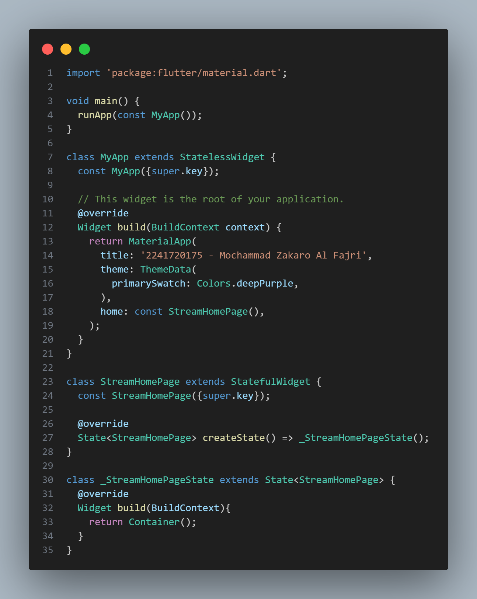
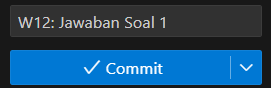

# Praktikum 12 | Lanjutan State Management dengan Streams

**NAMA : MOCHAMMAD ZAKARO AL FAJRI**

**KELAS : TI - 3F**

**ABSEN : 14**

**NIM : 2241720175**

---

## Praktikum 1 : Dart Streams

### Langkah 1: Buat Project Baru

Buatlah sebuah project flutter baru dengan nama stream_nama (beri nama panggilan Anda) di folder week-12/src/ repository GitHub Anda.

### Langkah 2: Buka file main.dart

Ketikkan kode sesuai dengan contoh yang diberikan.

### Soal 1

**1. Tambahkan nama panggilan Anda pada title app sebagai identitas hasil pekerjaan Anda.**

**2. Gantilah warna tema aplikasi sesuai kesukaan Anda.**

**3. Lakukan commit hasil jawaban Soal 1 dengan pesan "W12: Jawaban Soal 1"**

