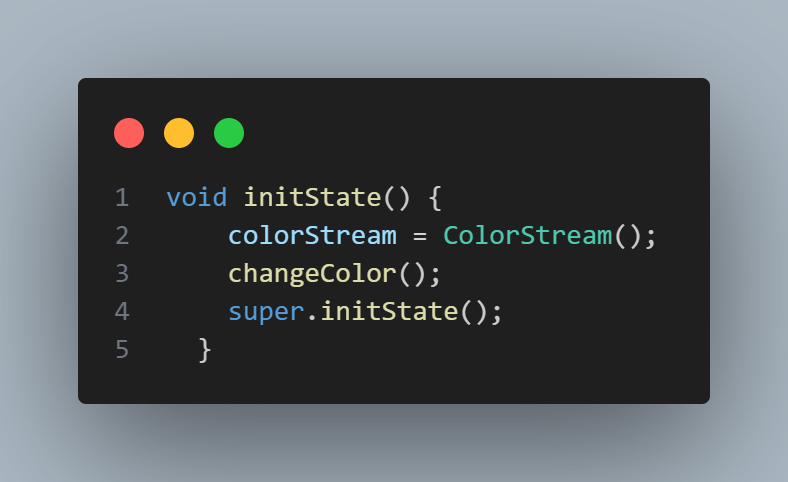
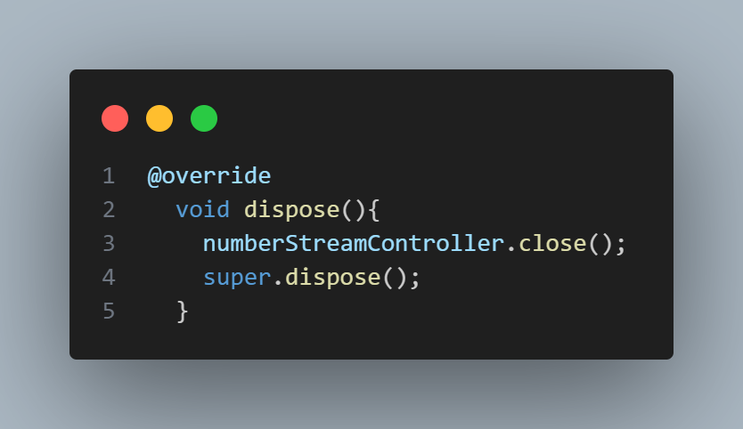
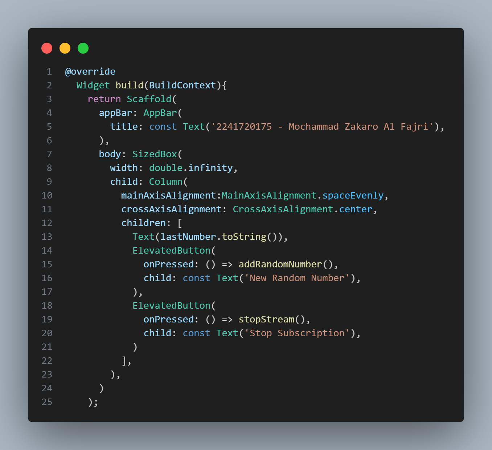

# Praktikum 12 | Lanjutan State Management dengan Streams

**NAMA : MOCHAMMAD ZAKARO AL FAJRI**

**KELAS : TI - 3F**

**ABSEN : 14**

**NIM : 2241720175**

---

## Praktikum 1 : Dart Streams

### Langkah 1: Buat Project Baru

Buatlah sebuah project flutter baru dengan nama stream_nama (beri nama panggilan Anda) di folder week-12/src/ repository GitHub Anda.

### Langkah 2: Buka file main.dart

Ketikkan kode sesuai dengan contoh yang diberikan.

### Soal 1

**1. Tambahkan nama panggilan Anda pada title app sebagai identitas hasil pekerjaan Anda.**

**2. Gantilah warna tema aplikasi sesuai kesukaan Anda.**

**3. Lakukan commit hasil jawaban Soal 1 dengan pesan "W12: Jawaban Soal 1"**

### Langkah 3: Buat file baru stream.dart

Buat file baru di folder lib project Anda lalu isi sesuai dengan contoh kode yang diberikan

### Langkah 4: Tambah variabel colors

Tambahkan variabel di dalam class ColorStream

### Soal 2 

**1. Tambahkan 5 warna lainnya sesuai keinginan Anda pada variabel colors tersebut.**

**2. Lakukan commit hasil jawaban Soal 2 dengan pesan "W12: Jawaban Soal 2"**

### Langkah 5: Tambah method getColors()

Di dalam class ColorStream ketik method seperti kode berikut. Perhatikan tanda bintang di akhir keyword async* (ini digunakan untuk melakukan Stream data)

### Langkah 6: Tambah perintah yield*

Tambahkan kode sesuai dengan contoh

### Soal 3 

**1. Jelaskan fungsi keyword yield* pada kode tersebut!**

Jawab : Keyword yield* pada kode tersebut berfungsi untuk mengembalikan nilai dari sebuah fungsi generator lainnya. Generator sendiri adalah fungsi yang menghasilkan nilai secara bertahap atau berurutan. Dalam hal ini, kata kunci yield digunakan untuk mengembalikan setiap nilai yang dihasilkan oleh fungsi generator tersebut.

**2.Apa maksud isi perintah kode tersebut**

Jawab : Perintah dalam kode tersebut bertujuan untuk mengembalikan nilai dari sebuah fungsi generator yang memuat daftar warna yang telah ditentukan sebelumnya.

**3.Lakukan commit hasil jawaban Soal 3 dengan pesan "W12: Jawaban Soal 3"**

### Langkah 7: Buka main.dart

**Ketik kode impor file ini pada file main.dart**

### Langkah 8: Tambah variabel

**Ketik dua properti ini di dalam class _StreamHomePageState**

### Langkah 9: Tambah method changeColor()

**Tetap di file main, Ketik kode seperti berikut**

### Langkah 10: Lakukan override initState()

### Langkah 11: Ubah isi Scaffold()

### Langkah 12: Run

### Soal 4

**1.Capture hasil praktikum Anda berupa GIF dan lampirkan di README.**

Jawab : 

**Lakukan commit hasil jawaban Soal 4 dengan pesan "W12: Jawaban Soal 4"**

### Langkah 13: Ganti isi method changeColor()

### Soal 5

**1.Jelaskan perbedaan menggunakan listen dan await for (langkah 9) !**

Jawab : 

Perbedaan : 

- **listen**: Berfungsi untuk mendeteksi perubahan pada sebuah stream. Saat stream menghasilkan data, kode yang didefinisikan di dalam callback `listen` akan dieksekusi. `listen` biasanya digunakan untuk penanganan asynchronous tanpa menghentikan eksekusi kode berikutnya.

- **await for**: Digunakan untuk menunggu data dari sebuah stream secara sequential. Saat stream mengeluarkan data, kode di dalam blok `await for` akan dijalankan. Proses ini bersifat synchronous, sehingga akan menunggu hingga stream selesai sebelum melanjutkan eksekusi kode berikutnya.

**2. Lakukan commit hasil jawaban Soal 5 dengan pesan "W12: Jawaban Soal 5"**

## Praktikum 2: Stream controllers dan sinks

### Langkah 1: Buka file stream.dart

### Langkah 2: Tambah class NumberStream

### Langkah 3: Tambah StreamController

**Di dalam class NumberStream buatlah variabel StreamController**

### Langkah 4: Tambah method addNumberToSink

### Langkah 5: Tambah method close()

### Langkah 6: Buka main.dart

**Ketik kode import seperti berikut**

### Langkah 7: Tambah variabel

### Langkah 8: Edit initState()

### Langkah 9: Edit dispose()

### Langkah 10: Tambah method addRandomNumber()

### Langkah 11: Edit method build()

### Langkah 12: Run

### Soal 6

**1.Jelaskan maksud kode langkah 8 dan 10 tersebut!**

Jawab : 

- Inisialisasi variabel lastNumber: Variabel ini berfungsi untuk menyimpan nilai terakhir yang dihasilkan oleh stream.

- Penggunaan StreamController: Digunakan sebagai pengendali utama dalam pembuatan dan pengelolaan stream.

- Pembuatan NumberStream: Berperan dalam menghasilkan serta mengatur aliran data pada stream.

**2.Capture hasil praktikum Anda berupa GIF dan lampirkan di README.**

**3.Lalu lakukan commit dengan pesan "W12: Jawaban Soal 6".**

### Langkah 13: Buka stream.dart

### Langkah 14: Buka main.dart

**Tambahkan method onError di dalam class StreamHomePageState pada method listen di fungsi initState()**

### Langkah 15: Edit method addRandomNumber()

### Soal 7

**1.Jelaskan maksud kode langkah 13 sampai 15 tersebut!**

Jawab :  Kode ini bertujuan untuk memasukkan error ke dalam aliran data stream yang sedang dihasilkan. Error ditambahkan melalui sink yang merupakan bagian dari stream untuk mengelola data atau error secara langsung.

**2.Kembalikan kode seperti semula pada Langkah 15, comment addError() agar Anda dapat melanjutkan ke praktikum 3 berikutnya.**

**3.Lalu lakukan commit dengan pesan "W12: Jawaban Soal 7".**

## Praktikum 3: Injeksi data ke streams

### Langkah 1: Buka main.dart

**Tambahkan variabel baru di dalam class _StreamHomePageState**

### Langkah 2: Tambahkan kode ini di initState

### Langkah 3: Tetap di initState

**Lakukan edit seperti kode berikut.**

### Langkah 4: Run

### Soal 8

**1.Jelaskan maksud kode langkah 1-3 tersebut!**

Jawab : 

- Langkah 1: Menambahkan variabel `StreamTransformer`. Variabel ini digunakan untuk memodifikasi data yang diterima dari stream sebelum diteruskan ke pengguna stream.

- Langkah 2: Inisialisasi `StreamTransformer` yang bertujuan untuk mengatur atau mendefinisikan transformasi data yang akan dilakukan oleh StreamTransformer.

- Langkah 3: Mengubah bagian `StreamController` dengan melakukan penyesuaian pada StreamController untuk mengontrol alur stream yang dihasilkan sesuai dengan transformasi yang didefinisikan.

**2.Capture hasil praktikum Anda berupa GIF dan lampirkan di README.**

## Praktikum 4: Subscribe ke stream events

### Langkah 1: Tambah variabel

**Tambahkan variabel berikut di class `_StreamHomePageState`**

### Langkah 2: Edit initState()

### Langkah 3: Tetap di initState()

**Tambahkan kode berikut ini.**

### Langkah 4: Tambah properti onDone()

### Langkah 5: Tambah method baru

**Ketik method ini di dalam class `_StreamHomePageState`**

### Langkah 6: Pindah ke method dispose()

### Langkah 7: Pindah ke method build()

### Langkah 8: Edit method addRandomNumber()

### Langkah 9: Run

### Langkah 10: Tekan button ‘Stop Subscription'

### Soal 9

**1.Jelaskan maksud kode langkah 2, 6 dan 8 tersebut!**

Jawab : 

- Langkah 2: Inisialisasi variabel `StreamSubscription`. Variabel ini digunakan untuk berlangganan (subscribe) ke stream agar dapat menerima data yang dihasilkan oleh stream.

- Langkah 6: Unsubscribe ke stream untuk menghentikan keanggotaan (unsubscribe) dari stream ketika aplikasi dihentikan, guna mencegah kebocoran sumber daya.

- Langkah 8: Angka acak antara 0-9 ditambahkan ke aliran data stream melalui sink, yang berfungsi sebagai pintu masuk untuk data atau event ke dalam stream.

**2.Capture hasil praktikum Anda berupa GIF dan lampirkan di README.**

## Praktikum 5: Multiple stream subscriptions

### Langkah 1: Buka file main.dart

**Ketik variabel berikut di class `_StreamHomePageState`**

### Langkah 2: Edit initState()

### Langkah 3: Run

### Soal 10

**1.Jelaskan mengapa error itu bisa terjadi ?**

Jawab : 

penyebab error : 

- Keterbatasan stream karena stream yang dihasilkan hanya mendukung satu kali subscribe.

- Jika stream di-subscribe lebih dari sekali, akan memicu error karena tidak memenuhi aturan penggunaan stream tersebut.

### Langkah 4: Set broadcast stream

### Langkah 5: Edit method build()

### Langkah 6: Run

### Soal 11

**1.Jelaskan mengapa hal itu bisa terjadi ?**

Jawab : Hal tersebut disebabkan oleh perubahan stream menjadi broadcast stream. Broadcast stream memungkinkan stream untuk di-subscribe berkali-kali, sehingga setiap kali tombol "Add Random Number" ditekan, data baru akan masuk ke dalam stream.

**2.Capture hasil praktikum Anda berupa GIF dan lampirkan di README.**

## Praktikum 6: StreamBuilder

### Langkah 1: Buat Project Baru

**Buatlah sebuah project flutter baru dengan nama streambuilder_nama (beri nama panggilan Anda) di folder repository GitHub Anda.**

### Langkah 2: Buat file baru stream.dart

### Langkah 3: Tetap di file stream.dart

**Ketik kode seperti berikut.**

### Langkah 4: Edit main.dart

### Langkah 5: Tambah variabel

**Di dalam class `_StreamHomePageState`, ketika variabel ini.**

### Langkah 6: Edit initState()

### Langkah 7: Edit method build()

### Langkah 8: Run

### Soal 12

**1.Jelaskan maksud kode pada langkah 3 dan 7 !**

Jawab : 

- Langkah 3: Membuat method `getNumbers()` yang berfungsi untuk menghasilkan stream yang berisi daftar angka acak antara 0 hingga 9.

- Langkah 7: Menggunakan StreamBuilder untuk menampilkan data yang dihasilkan oleh stream ke dalam aplikasi secara dinamis.

**2.Capture hasil praktikum Anda berupa GIF dan lampirkan di README.**

