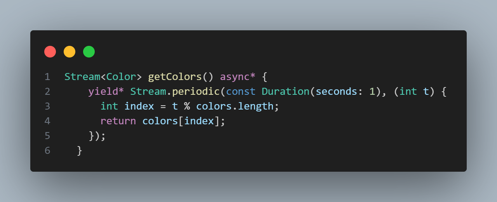

# Praktikum 12 | Lanjutan State Management dengan Streams

**NAMA : MOCHAMMAD ZAKARO AL FAJRI**

**KELAS : TI - 3F**

**ABSEN : 14**

**NIM : 2241720175**

---

## Praktikum 1 : Dart Streams

### Langkah 1: Buat Project Baru

Buatlah sebuah project flutter baru dengan nama stream_nama (beri nama panggilan Anda) di folder week-12/src/ repository GitHub Anda.

### Langkah 2: Buka file main.dart

Ketikkan kode sesuai dengan contoh yang diberikan.

### Soal 1

**1. Tambahkan nama panggilan Anda pada title app sebagai identitas hasil pekerjaan Anda.**

**2. Gantilah warna tema aplikasi sesuai kesukaan Anda.**

**3. Lakukan commit hasil jawaban Soal 1 dengan pesan "W12: Jawaban Soal 1"**

### Langkah 3: Buat file baru stream.dart

Buat file baru di folder lib project Anda lalu isi sesuai dengan contoh kode yang diberikan

### Langkah 4: Tambah variabel colors

Tambahkan variabel di dalam class ColorStream

### Soal 2 

**1. Tambahkan 5 warna lainnya sesuai keinginan Anda pada variabel colors tersebut.**

**2. Lakukan commit hasil jawaban Soal 2 dengan pesan "W12: Jawaban Soal 2"**

### Langkah 5: Tambah method getColors()

Di dalam class ColorStream ketik method seperti kode berikut. Perhatikan tanda bintang di akhir keyword async* (ini digunakan untuk melakukan Stream data)

### Langkah 6: Tambah perintah yield*

Tambahkan kode sesuai dengan contoh

### Soal 3 

**1. Jelaskan fungsi keyword yield* pada kode tersebut!**

Jawab : Keyword yield* pada kode tersebut berfungsi untuk mengembalikan nilai dari sebuah fungsi generator lainnya. Generator sendiri adalah fungsi yang menghasilkan nilai secara bertahap atau berurutan. Dalam hal ini, kata kunci yield digunakan untuk mengembalikan setiap nilai yang dihasilkan oleh fungsi generator tersebut.

**2.Apa maksud isi perintah kode tersebut**

Jawab : Perintah dalam kode tersebut bertujuan untuk mengembalikan nilai dari sebuah fungsi generator yang memuat daftar warna yang telah ditentukan sebelumnya.

**3.Lakukan commit hasil jawaban Soal 3 dengan pesan "W12: Jawaban Soal 3"**