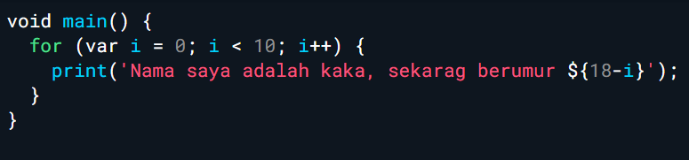
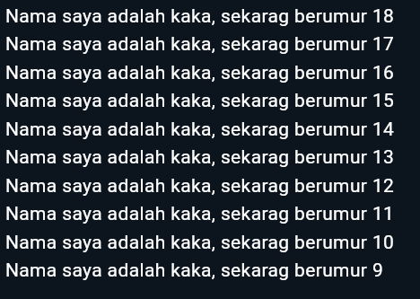

# Pertemuan 2 - Pemprogaman Mobile 

**NAMA : MOCHAMMAD ZAKARO AL FAJRI**

**KELAS : TI - 3F**

**NIM : 2241720175**

## Soal 1

**Modifikasi kode pada baris 3**

Output : 

## Soal 2 

**Mengapa sangat penting untuk memahami bahasa pemrograman Dart sebelum kita menggunakan framework Flutter ? Jelaskan!**

Jawab : Karena bahasa Dart merupakan elemen utama dari framework Flutter. Menguasai Dart menjadi hal yang sangat penting karena seluruh kode aplikasi, plugin, serta pengelolaan dependensi di Flutter ditulis menggunakan bahasa ini. Pemahaman yang kuat mengenai dasar-dasar Dart akan sangat membantu dalam proses pengembangan aplikasi menggunakan Flutter.

## Soal 3 

**Rangkumlah materi dari codelab ini menjadi poin-poin penting yang dapat Anda gunakan untuk membantu proses pengembangan aplikasi mobile menggunakan framework Flutter.**

Jawab : Dart adalah bahasa utama yang mendukung kerangka kerja Flutter, memainkan peran penting dalam pengembangan aplikasi mobile. Dart dirancang untuk memadukan keunggulan berbagai bahasa tingkat tinggi dengan fitur-fitur pemrograman modern, di antaranya:  

- **Productive tooling**: mendukung analisis kode, plugin IDE, serta memiliki ekosistem paket yang luas.  
- **Garbage collection**: membantu dalam pengelolaan dan dealokasi memori secara otomatis.  
- **Type annotations**: memastikan keamanan dan konsistensi dengan memberikan kontrol penuh terhadap data dalam aplikasi.  
- **Statically typed**: menghadirkan fitur type-safe dan type inference, memungkinkan analisis jenis data saat runtime.  
- **Portability**: mendukung pengembangan lintas platform, dari web hingga kompilasi native ke ARM dan x86.  

### Rangkuman : 

### Cara Kerja Dart

Eksekusi Dart dapat dilakukan melalui dua cara utama:  

1. **Dart Virtual Machine (VM)**  
2. **JavaScript Compilation**  

Kedua metode ini memungkinkan kode Dart untuk berjalan di berbagai lingkungan, dengan dukungan fitur utama seperti:  
- **Runtime Systems**: menyediakan eksekusi dinamis.  
- **Dart Core Libraries**: mendukung pengembangan dengan fungsi-fungsi inti.  
- **Garbage Collectors**: memastikan pengelolaan memori yang efisien.  

### Mode Eksekusi Dart  
Kode Dart dapat dijalankan dalam dua mode kompilasi:  

1. **Just-In-Time (JIT)**  
   Kompilasi JIT mengubah kode sumber menjadi kode mesin asli (native) saat runtime. Proses ini dilakukan sesuai kebutuhan dan dioptimalkan oleh Dart VM, membuat pengembangan aplikasi lebih interaktif.  

2. **Ahead-Of-Time (AOT)**  
   Dalam mode ini, kode Dart dikompilasi sebelumnya, menghasilkan performa aplikasi yang lebih cepat. Dart VM berperan sebagai sistem runtime dengan menyediakan garbage collector dan metode native dari Dart SDK.  

### Struktur Kode Dart  
Dart menawarkan struktur kode yang familier bagi pengembang dengan elemen-elemen seperti:  

- **Control Flow** dan **Functions** yang mirip dengan bahasa pemrograman lain.  
- **Object Orientation** untuk mendukung paradigma berorientasi objek.  
- **Operators**:  
  - **Equality Operators**: seperti `x == y`, yang memanggil metode `x.==(y)` untuk membandingkan kesetaraan.  
  - **Arithmetic Operators**: mendukung operasi matematika.  
  - **Increment and Decrement Operators**: untuk manipulasi nilai.  
  - **Equality and Relational Operators**: memungkinkan evaluasi hubungan antara data.  
  - **Logical Operators**: mendukung operasi logika untuk kontrol alur.  

## Soal 4 

**Buatlah slide yang berisi penjelasan dan contoh eksekusi kode tentang perbedaan Null Safety dan Late variabel ! (Khusus soal ini kelompok berupa link google slide). Kumpulkan jawaban Anda di spreadsheet pada tautan yang telah disediakan di grup telegram. Untuk soal nomor 1 sampai 3 push repo GitHub Anda.**

Jawab :  [Link Google Slide](https://docs.google.com/presentation/d/1yN7PDpNTLaMtshC1YMcAQzzAtF1x6iQQl286BsAvU78/edit?usp=sharing).