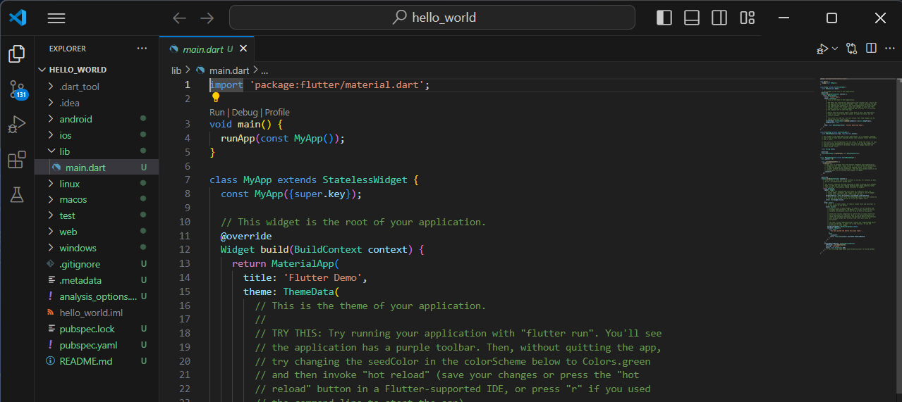

# 05 | Aplikasi Pertama dan Widget Dasar Flutter

**NAMA : MOCHAMMAD ZAKARO AL FAJRI**

**NIM : 2241720175**

**KELAS : TI - 3F**

**NO ABSEN : 14**

----

## Praktikum 1: Membuat Project Flutter Baru

**Langkah 1: Buka VS Code, lalu tekan tombol Ctrl + Shift + P maka akan tampil Command Palette, lalu ketik Flutter. Pilih New Application Project.**

Jawab : 

**Langkah 2: Kemudian buat folder sesuai style laporan praktikum yang Anda pilih. Disarankan pada folder dokumen atau desktop atau alamat folder lain yang tidak terlalu dalam atau panjang. Lalu pilih Select a folder to create the project in.**

Jawab : 

**Langkah 3: Buat nama project flutter hello_world seperti berikut, lalu tekan Enter. Tunggu hingga proses pembuatan project baru selesai.**

Jawab : 

**Langkah 4: Jika sudah selesai proses pembuatan project baru, pastikan tampilan seperti berikut. Pesan akan tampil berupa "Your Flutter Project is ready!" artinya Anda telah berhasil membuat project Flutter baru.**

Jawab : 

## Praktikum 2: Menghubungkan Perangkat Android atau Emulator

## Praktikum 3: Membuat Repository GitHub dan Laporan Praktikum

**Langkah 1: Login ke akun GitHub Anda, lalu buat repository baru dengan nama "flutter-fundamental-part1"**

**Langkah 2: Run program hello_world**

## Praktikum 4: Menerapkan Widget Dasar

**Langkah 1: Text Widget**

**Langkah 2: Image Widget**

## Praktikum 5: Menerapkan Widget Material Design dan iOS Cupertino

**Langkah 1: Cupertino Button dan Loading Bar**

**Langkah 2: Floating Action Button (FAB)**

**Langkah 3: Scaffold Widget**

**Langkah 4: Dialog Widget**

**Langkah 5: Input dan Selection Widget**

**Langkah 6: Date and Time Pickers**

## Tugas Praktikum

**Selesaikan Codelabs: Your first Flutter app, lalu buatlah laporan praktikumnya dan push ke repository GitHub Anda!**

[Link repo namer_app](https://github.com/Zakaal/namer_app/tree/4989f2b3dae032a03098b99b805fb37ddf5916a7/namer_app)

- **Create a project**
 

- **Add a button**
 

- **Make the app prettier**
 

- **Add functionality**
 

- **Add navigation rail**
 

- **Add a new page**
