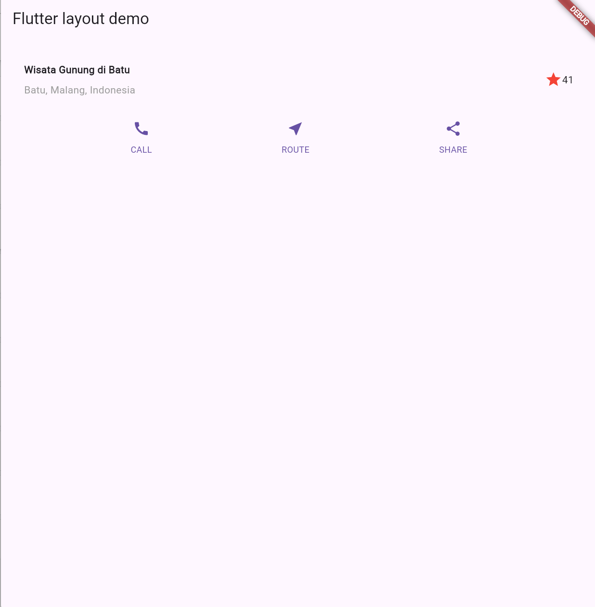
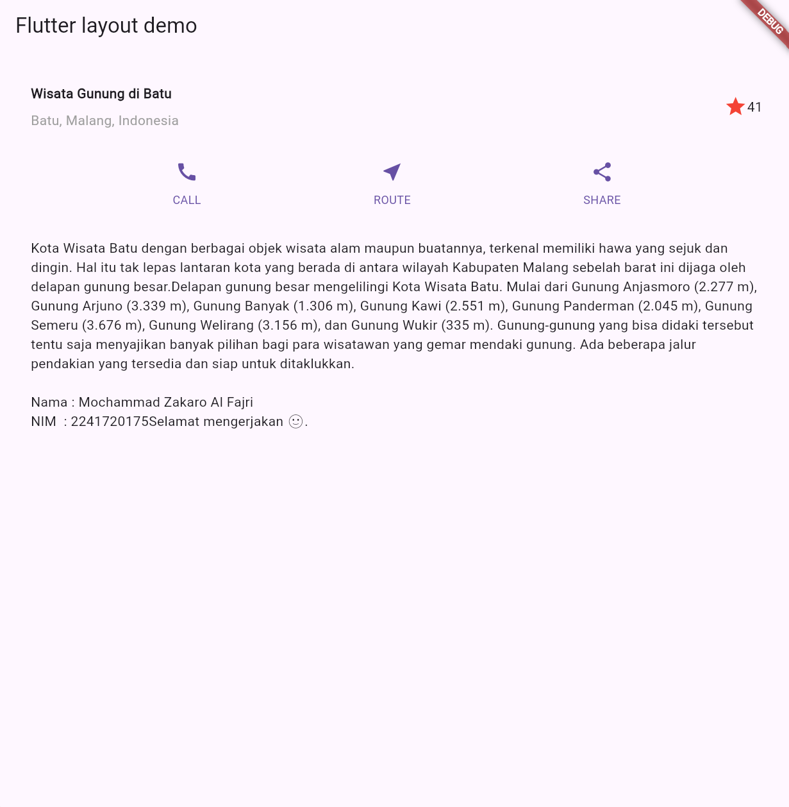
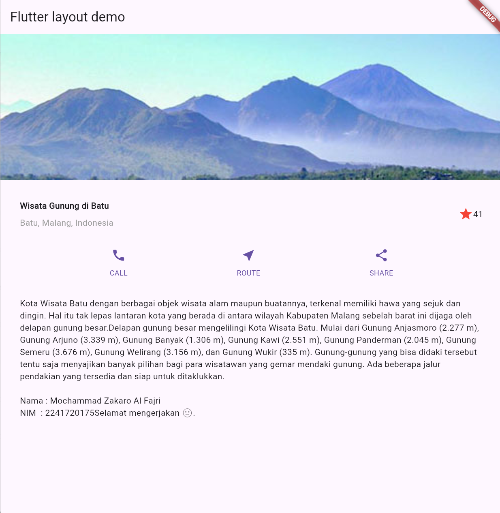
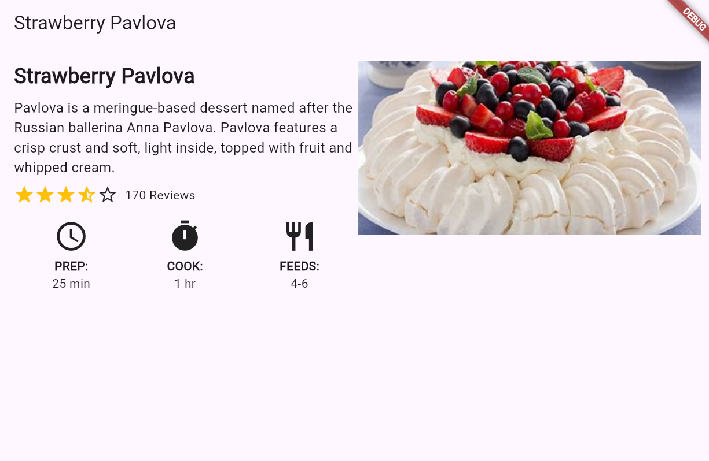

# 06 | Layout dan Navigasi
Nama: Alhamdana Fariz A.\
TI 3F - 03

> Praktikum 1

Memulai program dengan tiltl row

> Praktikum 2

Menerapkan penggunaan button

> Praktikum 3

Menerapkan penggunaan bagian teks

> Praktikum 4

Menampilkan gambar pada program

> Tugas 1

Menerapkan baris dan  kolom untuk membuat tampilan program 

> Praktikum 5 (tampilan home dan item)

Membangun Navigasi di Flutter

> Tugas 2 bagian 1

Pada aplikasi belanja, data dari item yang dipilih dikirim ke halaman detail menggunakan Navigator.pushNamed dengan menambahkan parameter arguments. Hal ini memungkinkan kita untuk mengirim objek Item ke halaman berikutnya dengan mudah, sehingga informasi yang relevan dapat diakses di halaman detail.

> Tugas 2 bagian 2 (Tampilan home dan item)

Di halaman ItemPage, informasi yang dikirimkan dari halaman sebelumnya dapat diakses menggunakan ModalRoute.of(context)!.settings.arguments. Dengan cara ini, kita dapat mengambil objek Item dan menggunakannya untuk menampilkan detail produk, seperti nama, harga, stok, dan rating.

> Tugas 2 bagian 3 (Tampilan home dan item)

Untuk memberikan efek transisi yang halus saat navigasi antara halaman, kita menerapkan Hero widget pada gambar item. Widget ini mengaitkan tag yang sama pada kedua halaman, sehingga ketika pengguna mengetuk gambar, gambar akan "bertransformasi" dari halaman awal ke halaman detail, memberikan pengalaman yang lebih interaktif.

> Tugas 2 bagian 4

Untuk meningkatkan pengalaman pengguna dan memudahkan navigasi, tampilan aplikasi diubah menjadi GridView. Setiap item ditampilkan dalam bentuk grid, menyerupai aplikasi marketplace pada umumnya. Hal ini tidak hanya meningkatkan estetika tetapi juga memudahkan pengguna dalam mencari dan memilih produk.

>  Tugas 2 bagian 5

Untuk meningkatkan keterbacaan dan manajemen kode, widget dibagi menjadi komponen yang lebih kecil. Misalnya, ItemCard dibuat sebagai widget terpisah, yang memuat detail setiap item. Hal ini memungkinkan pengembangan yang lebih modular dan memudahkan perawatan aplikasi di masa mendatang.
Pada bagian footer aplikasi, ditambahkan informasi pribadi seperti Nama dan NIM.

    - Pembagian program menjadi lebih kecil

    - Tampilan

> Tugas 2 bagian 6

Penggunaan go_router sebagai alternatif untuk navigasi memberikan cara yang lebih efisien dan terstruktur dalam menangani rute dan parameter.

    - Penggunaan go router pada pubspec.yaml

    - penggunaan go router pada main.dart

> Hasil Akhir Tampilan

