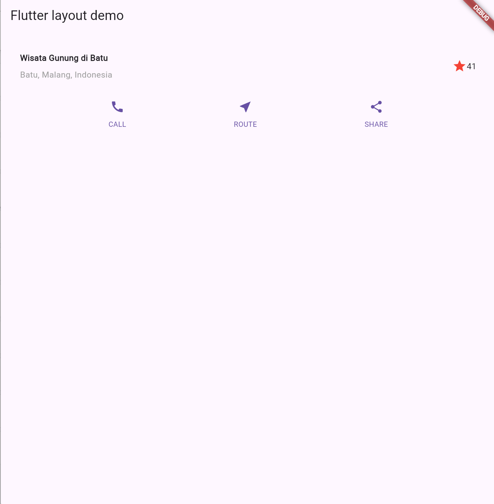
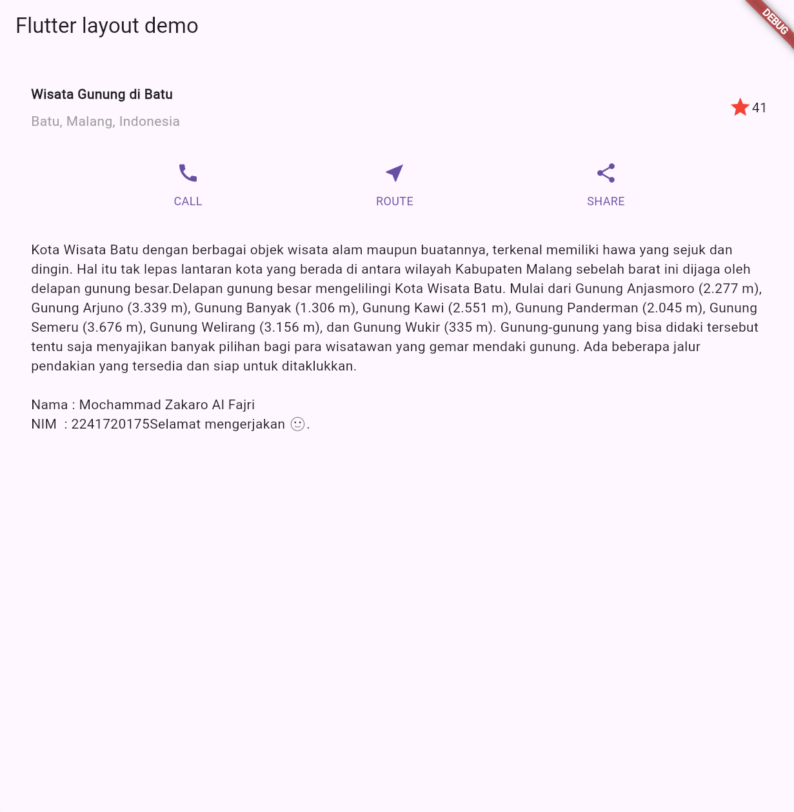

# 06 | Layout dan Navigasi #

**Nama : Mochammad Zakaro Al Fajri** 

**NIM : 2241720175**

**Kelas : TI - 3F**

**No.absen : 13**

## PRAKTIKUM 1 : Membangun Layout di Flutter

Menerapkan cara kerja mekanisme tat letak flutter, Cara menata widget secara vertikal dan horizontal, Cara membuat tata letak Flutter


## Praktikum 2: Implementasi button row



## Praktikum 3: Implementasi text section



## Praktikum 4: mplementasi image section


## Tugas Praktikum 1 


## Praktikum 5 


## Tugas Praktikum 2 

1. Untuk melakukan pengiriman data ke halaman berikutnya, cukup menambahkan informasi arguments pada penggunaan Navigator. Perbarui kode pada bagian Navigator menjadi seperti berikut.

```
Navigator.pushNamed(context, '/item', arguments: item);
```

2. Pembacaan nilai yang dikirimkan pada halaman sebelumnya dapat dilakukan menggunakan ModalRoute. Tambahkan kode berikut pada blok fungsi build dalam halaman ItemPage. Setelah nilai didapatkan, anda dapat menggunakannya seperti penggunaan variabel pada umumnya.

```
final itemArgs = ModalRoute.of(context)!.settings.arguments as Item;
```

3. Pada hasil akhir dari aplikasi belanja yang telah anda selesaikan, tambahkan atribut foto produk, stok, dan rating. Ubahlah tampilan menjadi GridView seperti di aplikasi marketplace pada umumnya.

4. Silakan implementasikan Hero widget pada aplikasi belanja Anda

5. Sesuaikan dan modifikasi tampilan sehingga menjadi aplikasi yang menarik. Selain itu, pecah widget menjadi kode yang lebih kecil. Tambahkan Nama dan NIM di footer aplikasi belanja Anda.

6. Selesaikan Praktikum 5: Navigasi dan Rute tersebut. Cobalah modifikasi menggunakan plugin go_router

**HASIL**

HOME PAGE 


ITEM PAGE 

