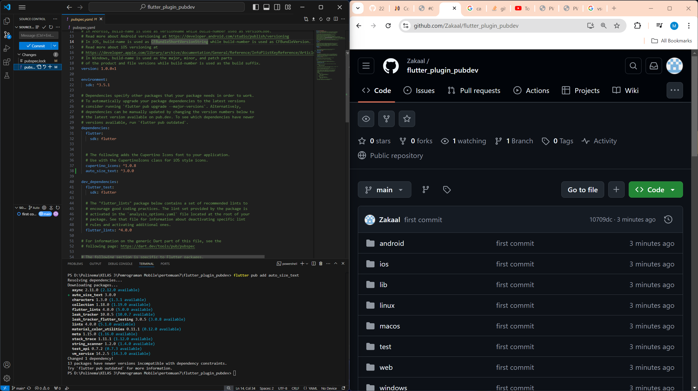
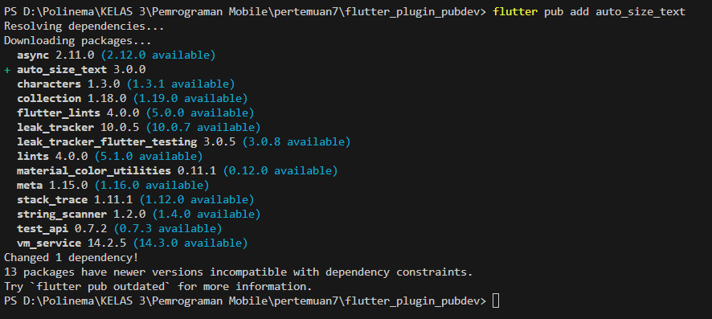
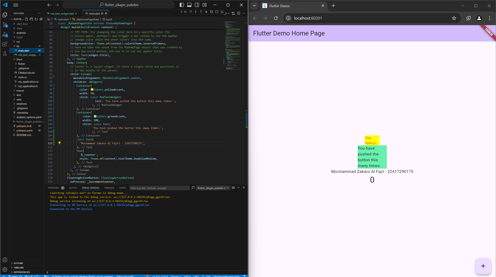

# 07 | Manajemen Plugin

**Nama** : Mochammad Zakaro Al Fajri

**NIM** : 2241720175

**Kelas** : TI-3F

**No. Absen** : 14

---

## Praktikum Menerapkan Plugin di Project Flutter

### Langkah 1 : Buat Project Baru

Membuat project baru dengan nama `flutter_plugin_pubdev`, lalu jadikan repository di GitHub Anda dengan nama `flutter_plugin_pubdev`.

**Jawab** : 



### Langkah 2 : Menambahkan Plugin

Tambahkan plugin `auto_size_text` menggunakan perintah berikut di terminal

```
flutter pub add auto_size_text
```

Jika berhasil, maka akan tampil nama plugin beserta versinya di file pubspec.yaml pada bagian dependencies.

**Jawab** : 



### Langkah 3 : Buat file red_text_widget.dart

Buat file baru bernama `red_text_widget.dart` di dalam folder lib lalu isi kode seperti berikut.

```dart
import 'package:flutter/material.dart';

class RedTextWidget extends StatelessWidget {
    const RedTextWidget({Key? key} : super(key: key));

    @override
    Widget build(BuildContext context) {
        return Container();
    }
}
```

### Langkah 4 : Tambah Widget AutoSizeText

Masih di file `red_text_widget.dart`, untuk menggunakan plugin `auto_size_text`, ubahlah kode return Container() menjadi seperti berikut.

```dart
...
return AutoSizeText(
      text,
      style: const TextStyle(color: Colors.red, fontSize: 14),
      maxLines: 2,
      overflow: TextOverflow.ellipsis,
);
```

Setelah Anda menambahkan kode di atas, Anda akan mendapatkan info error. Mengapa demikian? Jelaskan dalam laporan praktikum Anda!

**Jawab** : error yang muncul disebabkan oleh variabel "text" yang belum dibuat.

### Langkah 5 : Membuat Variabel Text dan Parameter di Constructor

Tambahkan Variabel `Text` dan parameter di constructor seperti berikut : 

```dart
class RedTextWidget extends StatelessWidget {
    final String text;

    const RedTextWidget({Key? key, required this.text}) : super(key: key);
}

```

### Langkah 6 : Tambahkan widget di main.dart

Buka file `main.dart` lalu tambahkan di dalam `children:` pada class `_MyHomePageState`.

```dart
...
Container(
   color: Colors.yellowAccent,
   width: 50,
   child: const RedTextWidget(
             text: 'You have pushed the button this many times:',
          ),
),
Container(
    color: Colors.greenAccent,
    width: 100,
    child: const Text(
           'You have pushed the button this many times:',
          ),
),
```

**HASIL RUNNING** : 



## Tugas Praktikum 

### 1. Selesaikan Praktikum tersebut, lalu dokumentasikan dan push ke repository Anda berupa screenshot hasil pekerjaan beserta penjelasannya di file README.md!

### 2. Jelaskan maksud dari langkah 2 pada praktikum tersebut!

**Jawab :** Langkah 2 bertujuan untuk menambahkan paket `auto_size_text` ke dalam project yang sebelumnya sudah kita buat. Paket ini berfungsi membuat teks yang secara otomatis menyesuaikan ukurannya agar sesuai dengan ruang yang tersedia. Selain itu, paket ini juga berfungsi sebagai pengatur ukuran teks dinamis, mendukung multiline, dan pengatur batas teks

### 3. Jelaskan maksud dari langkah 5 pada praktikum tersebut!

**Jawab :** Pada langkah 5 bertujuan untuk pembuatan variabel, melakukan pengatuan parameter di construktor, dan membangun dasar untuk widget kustom yang dapat digunakan dalam berbagai konteks dengan berbagai teks. Variabel yang dideklarasikan yaitu variabel "teks" agar error pada langkah 4 tidak terjadi. Pengaturan parameter yang dilakukan yaitu parameter key dan text. {Key? key, required this.text} adalah daftar parameter untuk constructor. Key? key adalah opsional dan digunakan untuk membedakan widget di dalam widget tree. required this.text menunjukkan bahwa parameter text adalah wajib saat membuat instance dari widget ini.

### 4. Pada langkah 6 terdapat dua widget yang ditambahkan, jelaskan fungsi dan perbedaannya!

**Jawab :** 
1. RedTextWidget

- Memiliki fungsi untuk  menerima teks sebagai input dan dapat memiliki perilaku khusus, seperti penyesuaian ukuran teks menggunakan plugin auto_size_text

- Dengan menggunakan widget kustom, Anda dapat mengontrol penampilan dan perilaku teks dengan lebih fleksibel dan dapat menyesuaikan fungsionalitasnya.

2. Text

- Memiliki fungsi untuk menampilkan teks. Dalam contoh ini, widget ini menampilkan string yang sama seperti pada RedTextWidget

- Widget Text adalah solusi sederhana untuk menampilkan teks, dan tidak memerlukan kode tambahan untuk mengelola perilakunya. Namun, ia tidak memiliki fitur penyesuaian ukuran teks secara otomatis seperti yang dimiliki oleh RedTextWidget.

3. Perbedaan 

- RedTextWidget memungkinkan penyesuaian ukuran teks, sedangkan Text hanya menampilkan teks tanpa penyesuaian.

- RedTextWidget dapat dikembangkan lebih lanjut untuk menambahkan fitur lain, sedangkan Text adalah widget statis dengan fungsionalitas dasar.

### 5. Jelaskan maksud dari tiap parameter yang ada di dalam plugin auto_size_text berdasarkan tautan pada dokumentasi ini!

**Jawab :**

- key : Mengontrol bagaimana satu widget menggantikan widget lain dalam tree. Ini berguna untuk manajemen status widget yang lebih baik

- text : Teks yang akan ditampilkan.

- textKey : Mengatur kunci untuk widget Text yang dihasilkan

- style : Gaya teks yang akan diterapkan.

- minFontSize : Menetapkan batas minimum ukuran font saat melakukan penyesuaian otomatis pada ukuran teks.

- maxFontSize : Menetapkan batas maksimum ukuran font saat melakukan penyesuaian otomatis pada ukuran teks.

- stepGranularity : Menentukan ukuran langkah di mana ukuran font disesuaikan dengan batas yang ada

- presetFontSizes : Mengatur daftar ukuran font yang telah ditentukan sebelumnya

- group : Grup penyesuaian ukuran teks

- textAlign : Menentukan bagaimana teks harus diratakan secara horizontal, seperti TextAlign.left, TextAlign.center, atau TextAlign.right.

- textDirection : Menentukan arah teks

- locale : Digunakan untuk memilih font ketika karakter Unicode yang sama dapat dirender dengan cara berbeda, tergantung pada lokasi

- softWrap : Menentukan apakah teks harus terputus di garis putus

- wrapWords : Menentukan apakah kata-kata yang tidak muat dalam satu baris harus dibungkus.

- overflow: Menentukan bagaimana kelebihan visual harus ditangani.

- textScaleFactor: Menentukan jumlah piksel font untuk setiap piksel.

- maxLines: Menentukan jumlah maksimum baris untuk teks..

- semanticsLabel: Label semantik alternatif untuk teks ini, yang membantu dalam aksesibilitas
