# Pertemuan 09 | Kamera 

**NAMA : MOCHAMMAD ZAKARO AL FAJRI**

**NIM : 2241720175**

**KELAS : TI - 3F**

**NO ABSEN : 14**

## Praktikum 1: Mengambil Foto dengan Kamera di Flutter

### Langkah 1: Buat Project Baru

**Buatlah sebuah project flutter baru dengan nama kamera_flutter**

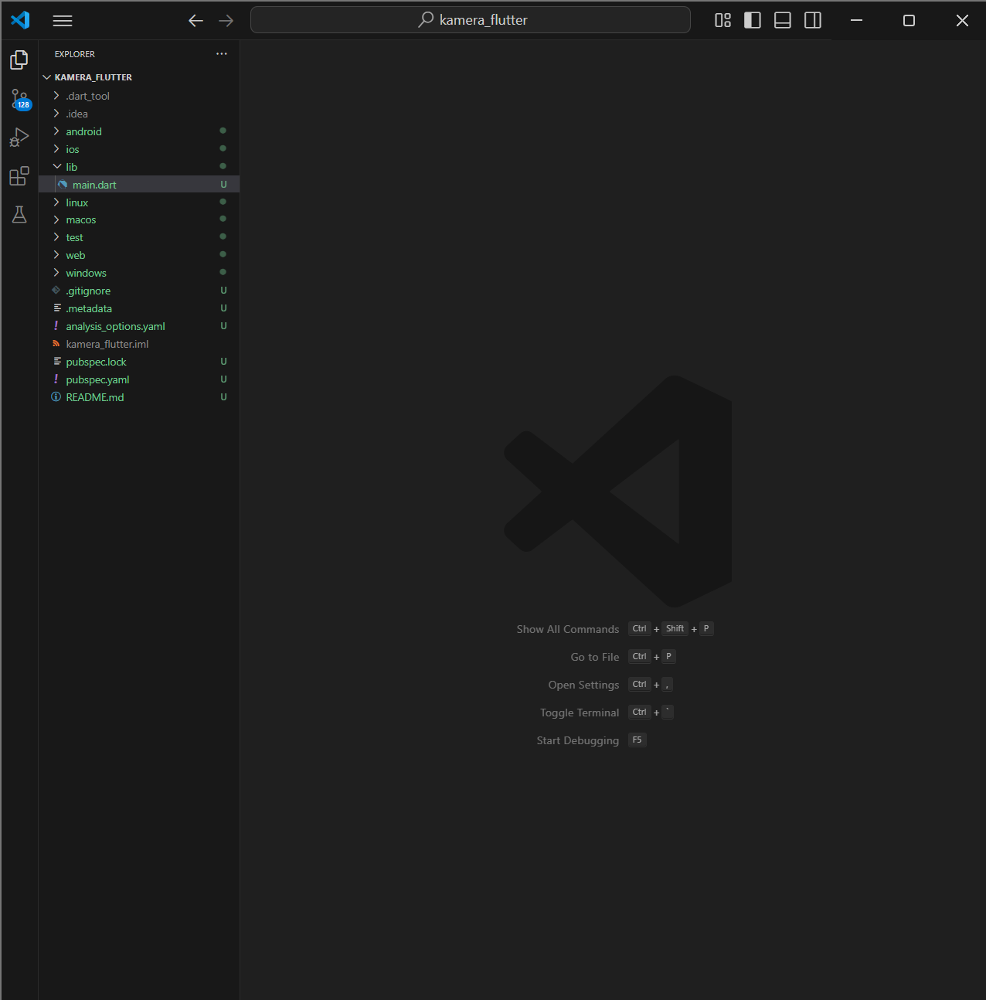

### Langkah 2: Tambah dependensi yang diperlukan

**Menambah menambahkan dependensi plugin**

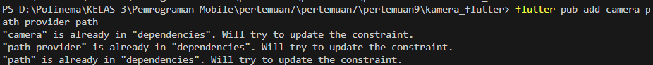

**Hasil :**

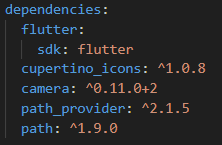

### Langkah 3: Ambil Sensor Kamera dari device

**Selanjutnya, kita perlu mengecek jumlah kamera yang tersedia pada perangkat menggunakan plugin camera seperti pada kode berikut ini. Kode ini letakkan dalam void main().**

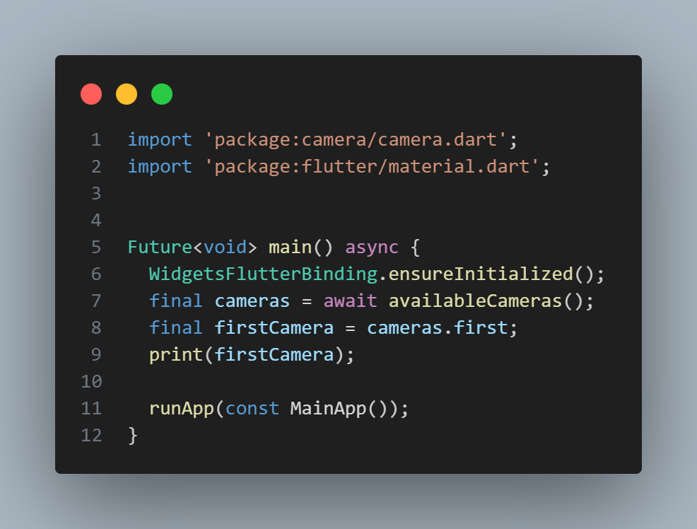

### Langkah 4: Buat dan inisialisasi CameraController

**Membuat dan menginisialisasi CameraController**

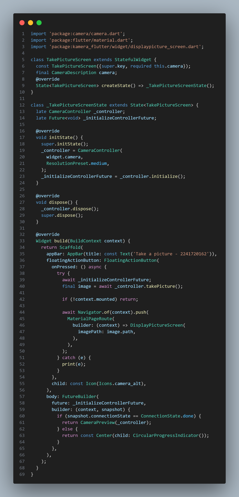

### Langkah 5: Gunakan CameraPreview untuk menampilkan preview foto

**Menggunakan widget `CameraPreview` dari package camera untuk menampilkan preview foto.**

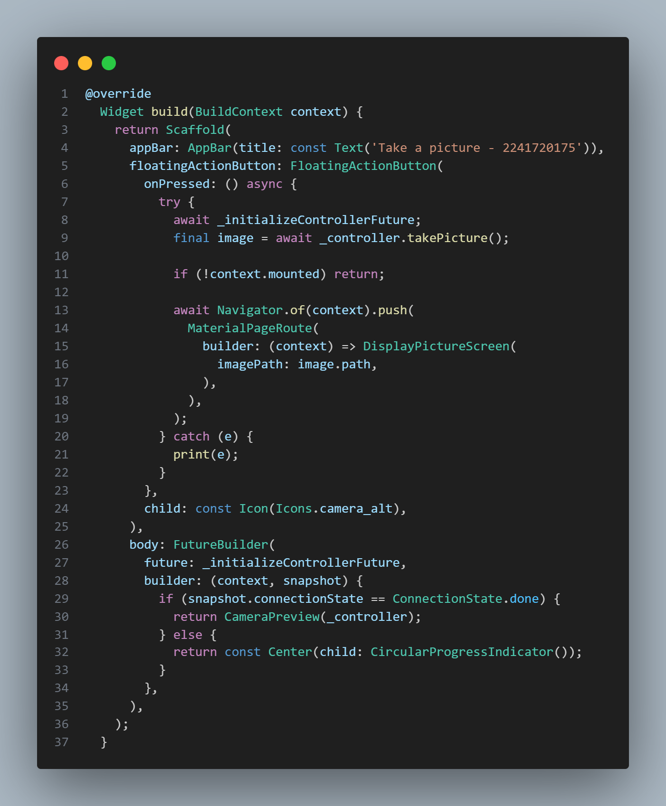

### Langkah 6: Ambil foto dengan CameraController

### Langkah 7: Buat widget baru DisplayPictureScreen

**Buatlah file baru pada folder widget yang berisi kode berikut.**

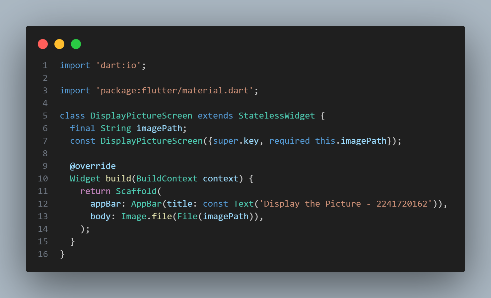

### Langkah 8: Edit main.dart

**Edit pada file ini bagian `runApp`.**

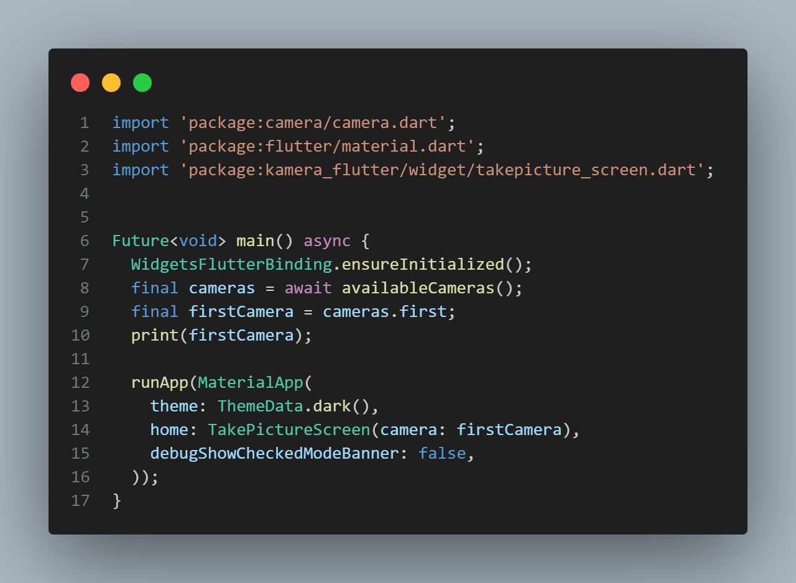

### Langkah 9: Menampilkan hasil foto

**Tambahkan kode seperti berikut pada bagian `try / catch` agar dapat menampilkan hasil foto pada `DisplayPictureScreen.`**

### Hasil : 

   

## Praktikum 2: Membuat photo filter carousel

### Langkah 1: Buat project baru

**Buatlah project flutter baru di pertemuan 09 dengan nama `photo_filter_carousel`**

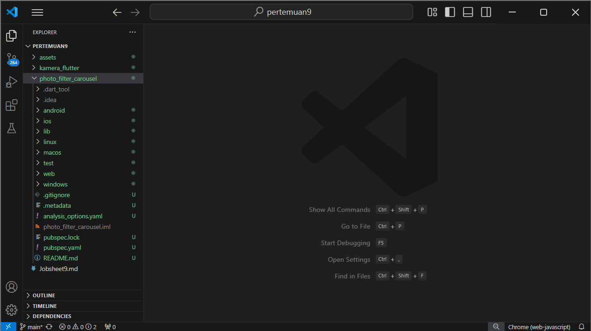

### Langkah 2: Buat widget Selector ring dan dark gradient

**Buatlah folder widget dan file baru yang berisi kode berikut.**

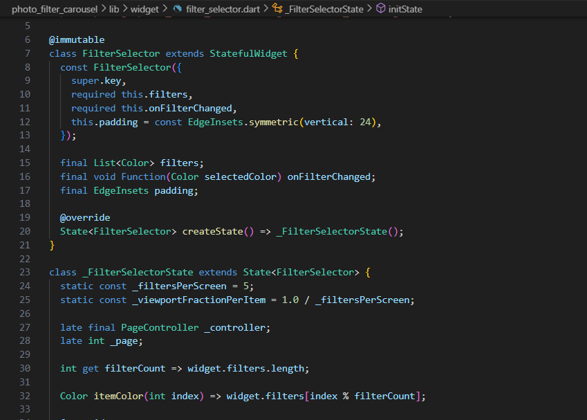

### Langkah 3: Buat widget photo filter carousel

**Buat file baru di folder widget dengan kode seperti berikut.**

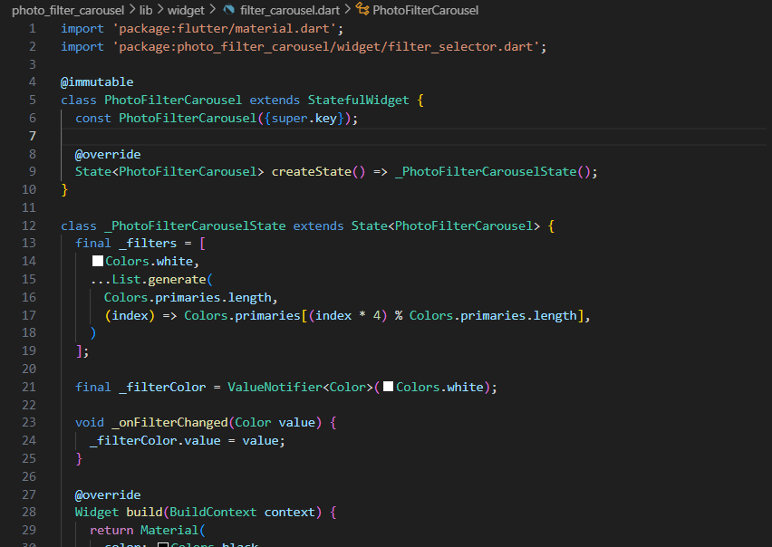

### Langkah 4: Membuat filter warna - bagian 1

**Buat file baru di folder widget seperti kode berikut.**

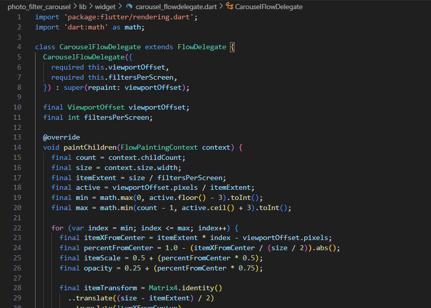

### Langkah 5: Membuat filter warna

**Buat file baru di folder widget seperti kode berikut ini.**

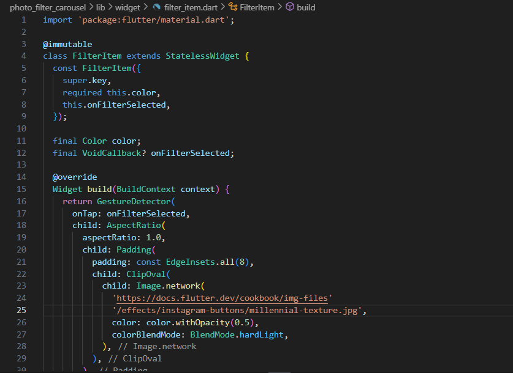

### Langkah 6: Implementasi filter carousel

**Terakhir, kita impor widget `PhotoFilterCarousel` ke main seperti kode berikut ini.**

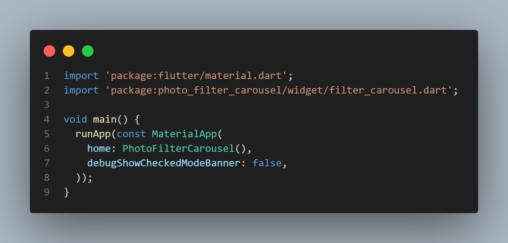

**Hasil :**

 

## Tugas Praktikum

#### 1. Gabungkan hasil praktikum 1 dengan hasil praktikum 2 sehingga setelah melakukan pengambilan foto, dapat dibuat filter carouselnya!

- Men-copy widget pada `photo_filter_corousel` ke `kamera_flutter`

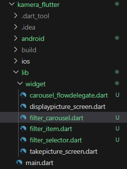

- Menambahkan parameter `filePath` pada `PhotoFilterCarousel`

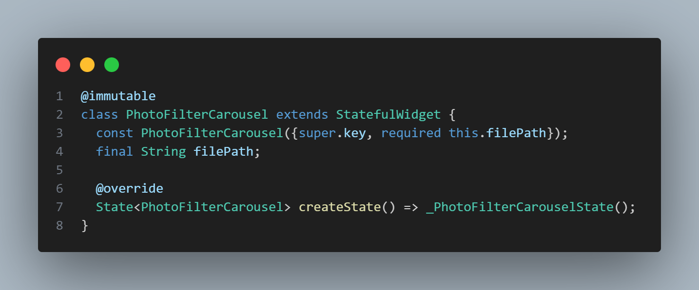

- Menambahkan `PhotoFilterCarousel` pada `DisplayPictureScreen`

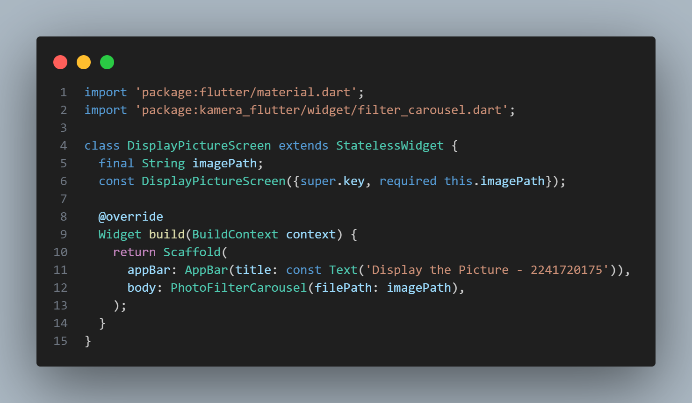

- Hasil : 

 

#### 2. Jelaskan maksud void async pada praktikum 1?

Jawab : Penggunaan `void async` untuk mengubah sebuah fungsi menjadi fungsi asynchronous yang dapat dieksekusi bersamaan dengan proses lainnya, yang berarti fungsi tersebut tidak perlu menunggu penyelesaian proses yang sedang berlangsung.

#### 3. Jelaskan fungsi dari anotasi @immutable dan @override ?

- @immutable: Anotasi ini menunjukkan bahwa objek atau kelas tidak dapat diubah setelah dibuat. Semua properti dalam kelas yang diberi anotasi ini harus bersifat final, memastikan objek tetap (immutable) sepanjang waktu.

- @override: Anotasi ini digunakan untuk menandakan bahwa metode dalam kelas turunan menggantikan implementasi metode yang ada di kelas induk. Ini membantu memastikan bahwa metode yang di-override sesuai dengan metode di kelas induk dan menghindari kesalahan penamaan.

